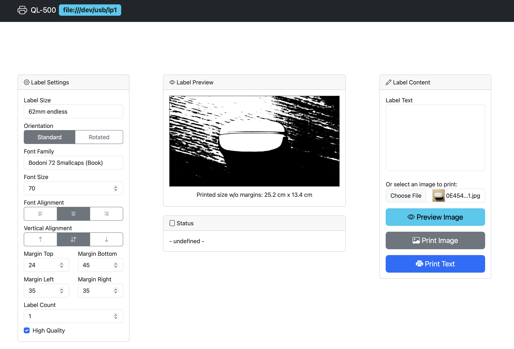

# brother_ql_web

**Full documentation and original README:** [original_README.md](./original_README.md)

---

This fork includes changes for my own needs

- Web UI Improvements
- Vertical alignment for rotated labels
- Image preview and print from Web UI

See [original_README.md](./original_README.md) for full usage, installation, and configuration details.
